# large-format-plasma-cnc
Design and structural analysis of a 7 × 3.5 m plasma/oxyfuel CNC machine: SolidWorks CAD, weldments, manufacturing drawings, linear static FEA, and build photos.
# Large-Format Plasma / Oxyfuel CNC Gantry (7 × 3.5 m)

**Mechanical design, manufacturing drawings, structural analysis (FEA) and build documentation of a large-format CNC cutting machine with a welded truss gantry.**

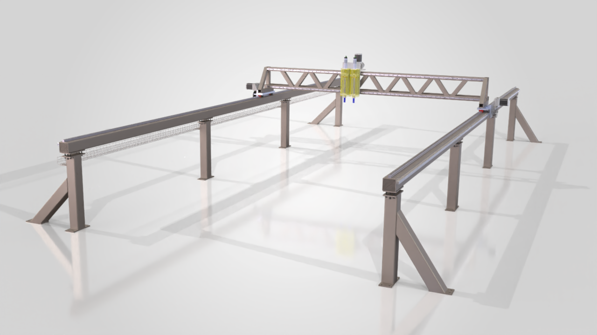
*CAD overview of the machine (SolidWorks). Footprint: 7 × 3.5 m.*

---

## Overview

This repository documents my work on a gantry-type CNC cutting machine with a 7 × 3.5 m footprint, fitted with a plasma torch and an oxyfuel torch. It was developed at TodoCNC.

<!-- CONFIRM: only keep the company name once the TodoCNC CEO has agreed to the material being public -->

The machine has two long rail beams on gusseted legs. A welded truss gantry travels along them on linear guides with a rack-and-pinion drive, and two motorized Z axes carry the torches. The repository contains the CAD views, some of the manufacturing drawings I prepared, two linear static FEA studies, and photos of the build.

**What this repository shows**
- Structural design with welded steel members: truss gantry, gusseted legs and bolted base plates
- Manufacturing drawings for machined plates and a weldment part, with dimensioned hole patterns
- Linear static FEA using beam and solid elements, with the loads, assumptions and limitations written down
- Hands-on build documentation: assembly, drives and control cabinet

## My role

I co-designed the machine at TodoCNC. My work included:

- Designing structural weldments and mounting plates in SolidWorks
- Preparing manufacturing drawings for machining and for locating holes and supports
- Linear static FEA of the structure (SolidWorks Simulation)
- Machining and hands-on assembly validation

<!-- CONFIRM: this list comes from your own description; add or remove items so it matches exactly what you did, and say who did the rest (e.g. the Z-axis design) if you want to be explicit -->

## Tools and methods

| Area | Tools / methods |
|---|---|
| CAD | SolidWorks: parts, assemblies, weldments, drawings |
| Analysis | SolidWorks Simulation: linear static, beam + solid mixed mesh |
| Motion | SolidWorks Motion Study |
| Materials | A36 Structural steel, 6061 aluminum alloy for mounting plates |

The Z-axis assemblies were modeled in a separate CAD package and imported into the SolidWorks assembly. For that reason there is no SolidWorks exploded view of them.

---

## Design

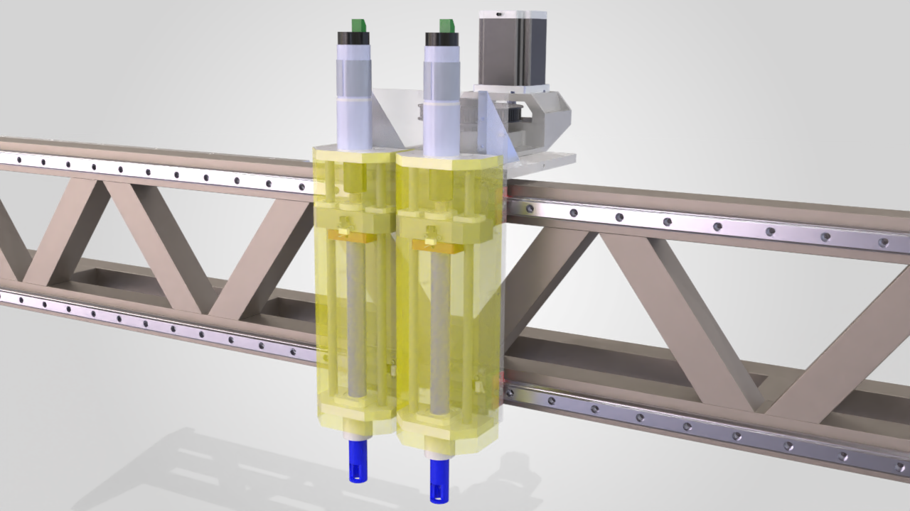
*Z-axis carriage mounted on the truss gantry, with the linear guide rails visible along the chords.*

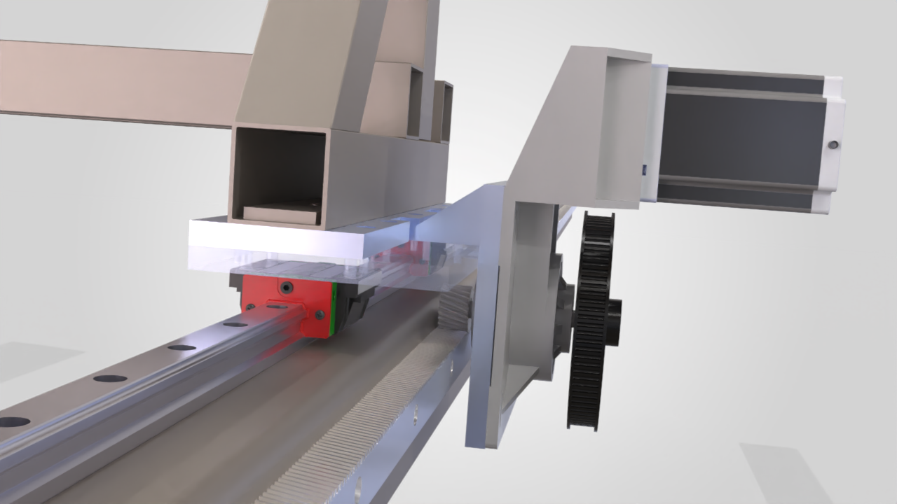
*Gantry end carriage: linear guide block on the rail, rack, belt transmission and stepper motor.*

### Main components

| Subsystem | Details |
|---|---|
| Structure | Welded steel truss gantry; two rail beams on gusseted legs with bolted base plates |
| Rail beams | 25 mm linear guide rail and 20 mm rack, 7 m each side |
| Gantry | 6 m of 25 mm linear guide rail and 6 m of 20 mm rack for the Z carriage; HGW25 linear guide blocks |
| Gantry drive | NEMA 34 stepper motor with belt and pulley transmission, rack-and-pinion |
| Z axes | Two ballscrew-driven assemblies (SFU1204 ballscrew, LMK12UU and LMK25UU linear bearings, limit microswitches) |
| Torches | Plasma torch and an oxyfuel torch assembly |
| Cable management | Cable carrier and wire cable tray |
| Control | Cabinet with CNC controller and stepper drives |

### Motion study

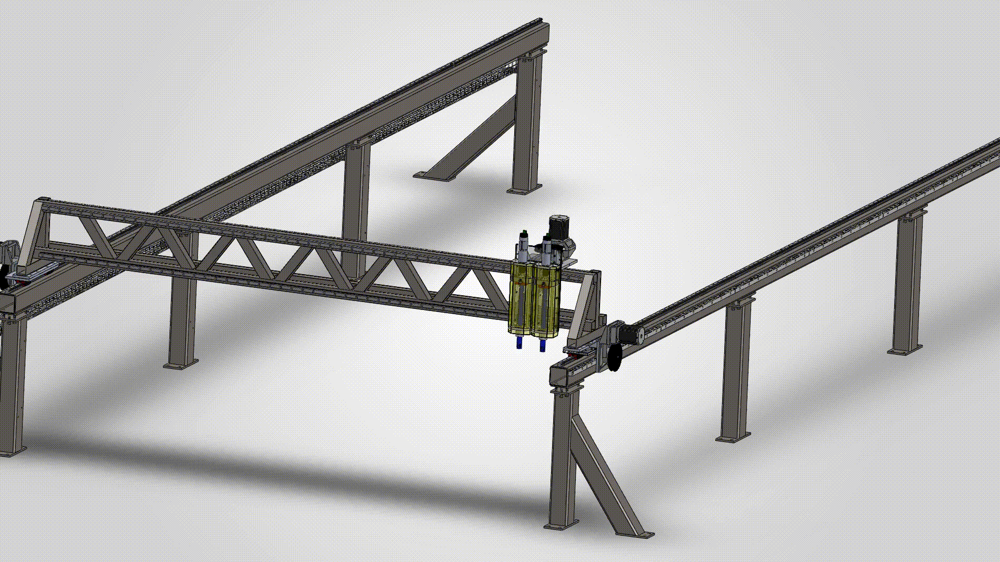

---

## Manufacturing drawings

Drawings were made in millimeters. Each one carries the hole table used for machining.

| Drawing | Part | Material (per drawing) |
|---|---|---|
| [`drawing_leg_with_gusset.jpg`](drawings/drawing_leg_with_gusset.jpg) | Welded leg with diagonal gusset, base plate and bolt holes | Steel A36 |
| [`drawing_base_plate_y.jpg`](drawings/drawing_base_plate_y.jpg) | Mounting plate, 400 × 135.1 × 12.7 mm, with countersunk and tapped (M6) hole pattern | 6061 alloy |
| [`drawing_x_axis_support.jpg`](drawings/drawing_x_axis_support.jpg) | Support plate, 250 × 427.93 × 12.7 mm, with 36 tagged holes | 6061 alloy |

<!-- CONFIRM: file names must match what you uploaded to /drawings; confirm 6061 is the material that was actually used for the x-axis support plate -->

---

## Structural analysis (FEA)

Two linear static studies were run in SolidWorks Simulation, split by the failure mode each one checks:

1. **Study 1: legs and rail beams.** The long-span support structure carrying the gantry.
2. **Study 2: gantry truss.** The moving crossbeam carrying the Z-axis assemblies.


### Study 1: legs and rail beams

**Model and mesh.** Beam elements for the legs and rail beams. Solid elements for the base plates, where local stress matters around the beam footprint. Components are bonded.

**Fixture.** Fixed at the base plates.

**Loads**

| Load | Value | Basis |
|---|---|---|
| Gravity | 9.81 m/s² | Self-weight of the modeled structure |
| Gantry and everything on it | 1,500 N, vertical, at mid-span | Estimated moving mass of about 129 kg (about 1,265 N), rounded up for margin |
| Guide rail and rack on each rail beam | 302 N per beam, distributed | Estimated mass of 7 m of rail and 7 m of rack per beam |
| Horizontal inertial load | 195 N | About 129 kg × 1.5 m/s², an equivalent static force for rapid moves or an emergency stop |

<!-- CONFIRM: that the 195 N force is applied horizontally, along the direction of gantry travel -->

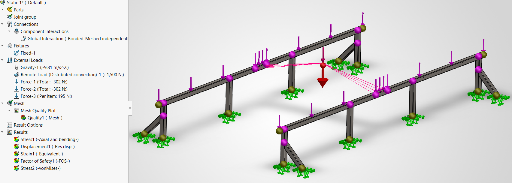
*Study tree with fixtures and loads, and the load arrows on the model.*

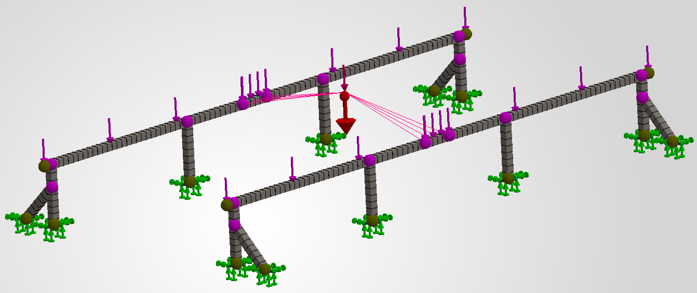
*Beam mesh on the legs and rail beams.*

**Results**

| Result | Value |
|---|---|
| Peak displacement | 0.095 mm, on the rail beams near the gantry load |
| Beam stress, axial + bending | From −4.78 MPa (compression) to +4.48 MPa (tension) |
| Base plate von Mises stress | 1.19 MPa peak |
| Yield strength used | 250 MPa |

<table>
  <tr>
    <td>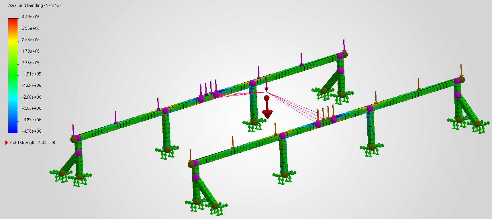</td>
    <td>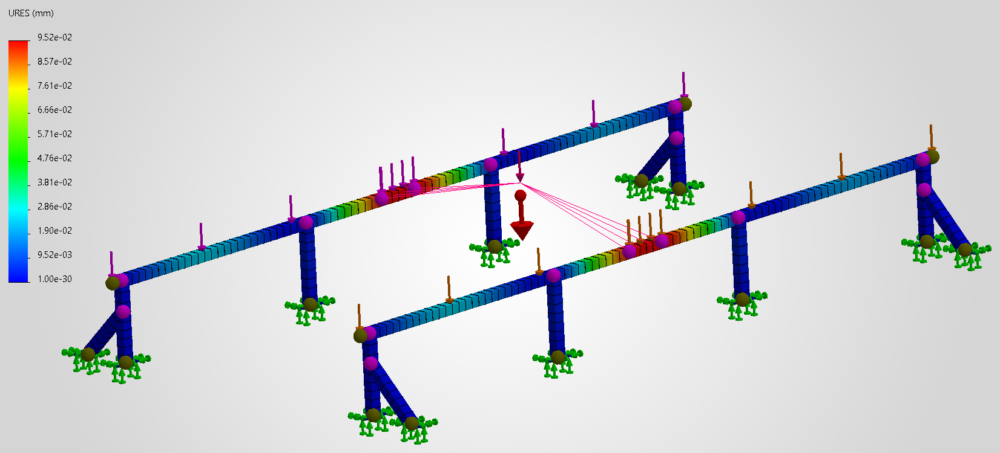</td>
  </tr>
  <tr>
    <td><em>Axial + bending stress (beam elements).</em></td>
    <td><em>Resultant displacement.</em></td>
  </tr>
</table>

<p align="center">
  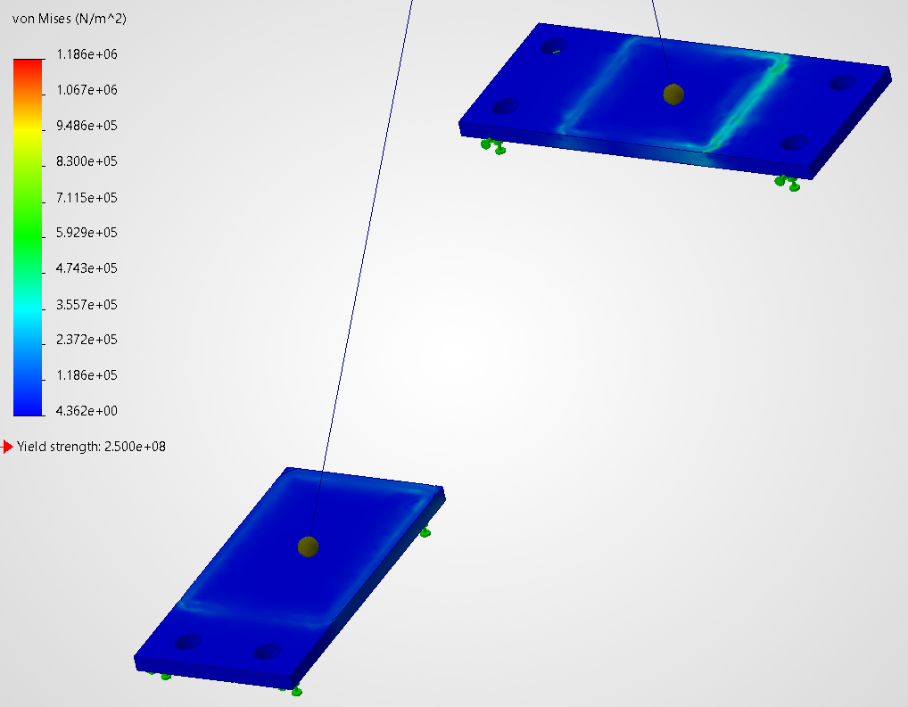
  <br>
  <em>Study 1 — Base plate von Mises stress</em>
</p>

*Von Mises stress on the solid-meshed base plates. Stress is highest around the perimeter where the leg meets the plate. Beam elements and solid elements need different stress plots, so the plate is reported separately from the beam stress.*

### Study 2: gantry truss

**Model and mesh.** Beam elements for the truss members.

**Fixture.** Fixed at both end supports. This is a simplification of the real condition, where the gantry rides on linear guide blocks.

**Loads.** 

| Load | Value | Basis |
|---|---|---|
| Guide rail and rack on top beam | 132.4 N, distributed | Estimated mass of 3 m of rail and 3 m of rack |
| Guide rail on bottom beam | 85.3 N, distributed | Estimated mass of 3 m of rail |
| Z-axis assemblies with plates, transmission and motor | 588.6 N, vertical, distributed at middle nodes | Estimated mass of about 60 kg |
| Gravity | 9.81 m/s² | Self-weight of the modeled structure |

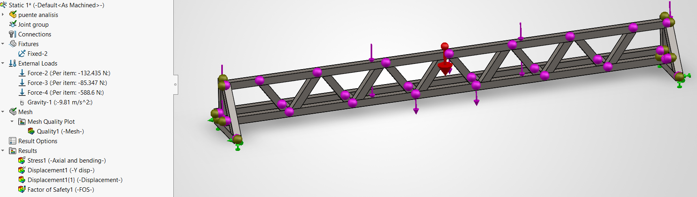
*Study tree with fixture and loads.*

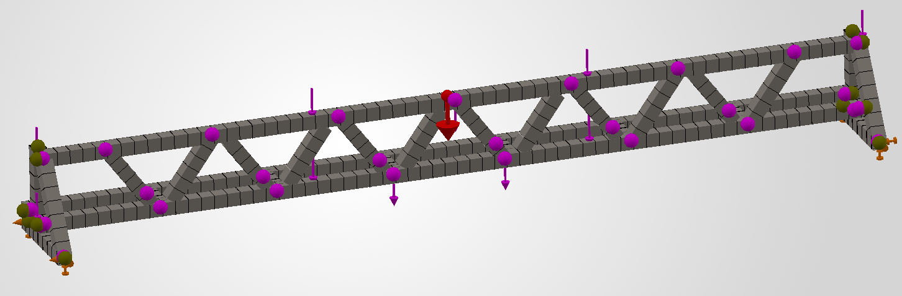
*Beam mesh on the truss.*

**Results**

| Result | Value |
|---|---|
| Peak vertical deflection | 0.361 mm (downward), at mid-span near the Z-axis load |
| Beam stress, axial + bending | From −16.8 MPa (compression) to +14.9 MPa (tension) |
| Yield strength used | 250 MPa |

<table>
  <tr>
    <td>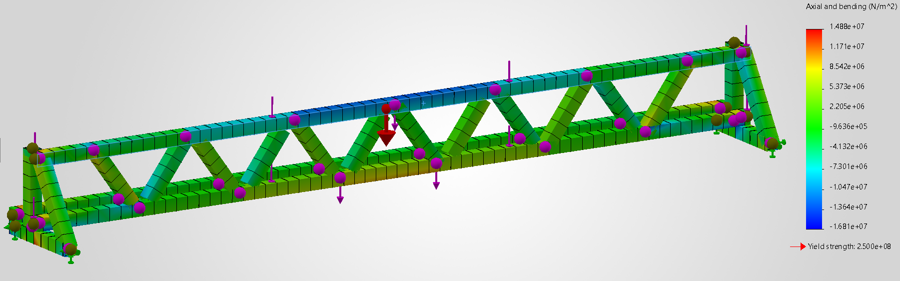</td>
    <td>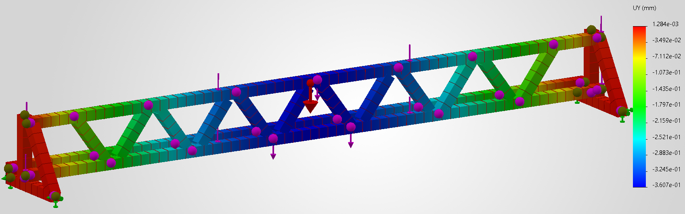</td>
  </tr>
  <tr>
    <td><em>Axial + bending stress. The top chord is in compression and the bottom chord is mostly in tension.</em></td>
    <td><em>Vertical displacement (UY).</em></td>
  </tr>
</table>

### Interpretation

Under these load cases, stresses stay far below yield: about 5 MPa in the support structure and about 17 MPa in the gantry, against 250 MPa. Strength is not the limiting factor here. Stiffness is more relevant for cut accuracy, because gantry sag affects the cut.

### Assumptions and limitations

- **Static analysis only.** Inertial effects in Study 1 are covered by an equivalent static force, using an assumed acceleration of 1.5 m/s². Study 2 has no inertial load.
- **Estimated masses.** The gantry structure mass comes from SolidWorks. The torches, cables and cable carrier, rail and rack, linear blocks, motor and the other components were estimated from typical catalog values and were not weighed.
- **Single load position.** The gantry load is applied at mid-span. End-of-travel positions were not analyzed.
- **Idealized joints.** Welds and bolted joints are modeled as bonded.
- **Simplified supports.** Fixed restraints stand in for the real bolted base plates and the carriage on the guide rails.
- **No physical validation.** The results were not checked against measured deflection on the finished machine.
- **Earlier work.** A comparison between structural configurations done during the original project is not included, because the original analysis files are no longer available.

---

## Build photos

<!-- ADD when available:  -->

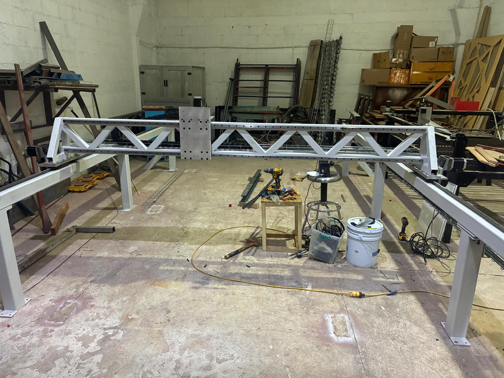

*Welded truss gantry assembled on the rail beams and legs.*


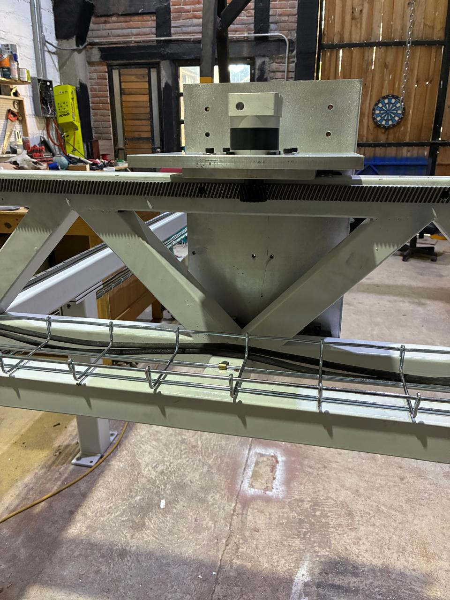

*Truss detail: rack, cable tray and the Z-axis mounting plate.*


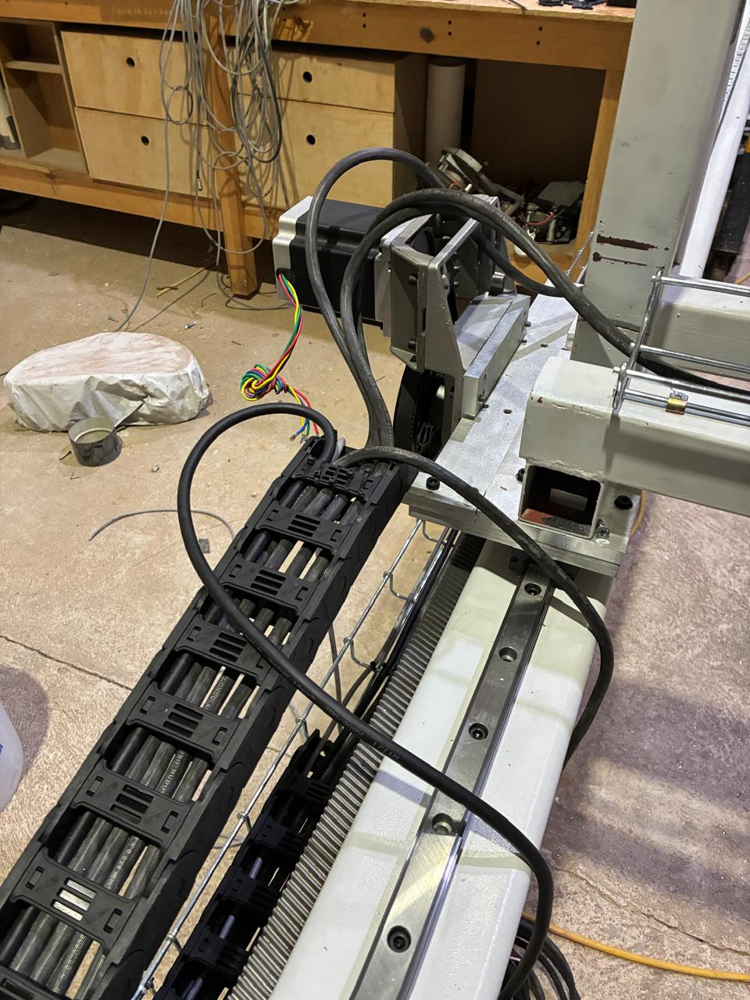

*Gantry drive end: stepper motor, belt transmission, cable carrier, linear guide and rack.*


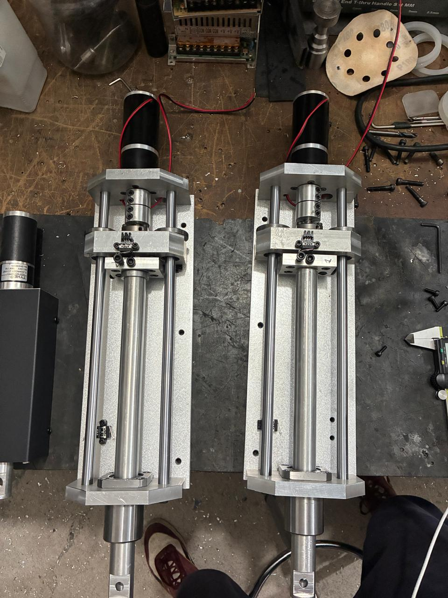

*Two Z-axis assemblies during bench assembly.*


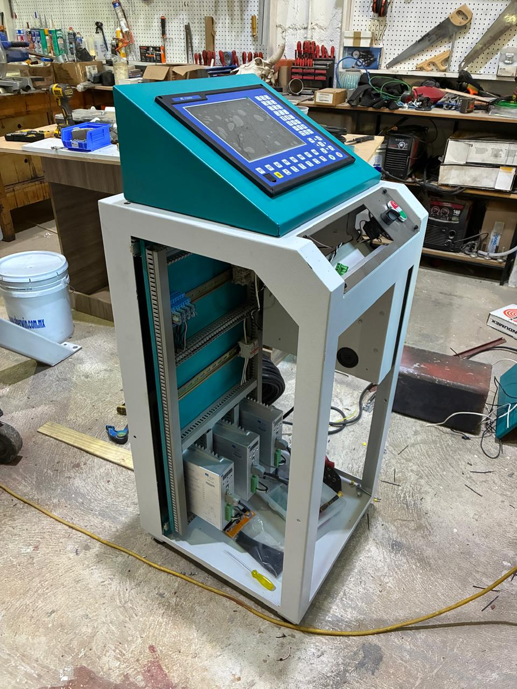

*Control cabinet with CNC controller and stepper drives.*

<!-- CONFIRM: add one line on current machine status (e.g. commissioned and cutting) only if you can state it exactly -->

---

## Repository structure

```
├── README.md
├── images/
│   ├── cad/      CAD views
│   ├── fea/      Simulation setup, mesh and results
│   └── build/    Photos of the build
├── drawings/     Manufacturing drawings (PDF)
└── media/        Motion study video
```

---

**Ian Delgadillo** · Automotive Technology Engineering student, Universidad Politécnica de Querétaro (UPQ) · Querétaro, México
